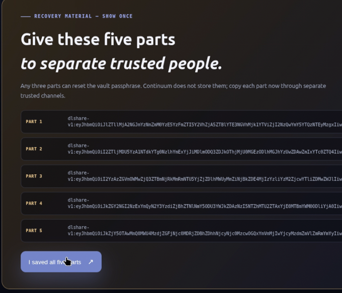

# Continuum Studio — OpenAI Build Week

## The product

Continuum Studio is a local-first digital-legacy companion. It makes an
encrypted archive understandable for the owner today and usable by trusted
people later. The product is not a generic chatbot around private files: it
combines deterministic classification, encrypted storage, access controls, and
a verifiable history with a calm conversational interface.

**Track:** Apps for your life.

<p align="center">
  
</p>

## Submission links

- **Demo video:** https://www.youtube.com/watch?v=Km_b6Apw_ak
- **Public repository:** https://github.com/olgavasilievaveg-hash/continuum
- **Apache License 2.0:** [`LICENSE`](LICENSE)
- **Static Vercel preview:** https://continuum-olga-demo.vercel.app/
- **Song — Continuum:** https://suno.com/song/049456fe-7d61-4820-8ccd-fb0377b7e925

## Where this comes from

Continuum is built and maintained by Olga Vasilieva. It began as a fork of
Digital Legacy, an Apache-2.0 project by her daughter, Anna Tchijova: a
deterministic, encrypted, audited memory system for the moment when someone
dies and the people who loved them inherit a hard drive with no map.

That foundation proved useful well before an inheritance event. Continuum
keeps its guarantees while making the same private, source-backed map useful
for hospitalizations, disability, dementia care, personal organization,
education, and everyday life.

## The live demo flow

1. Run the app and select **Explore a safe demo**.
2. Show the integrity signal, life-area map, and four protected memories.
3. Ask: `Where is the apartment deed?` The result has both a direct answer and
   its retrieved source.
4. Capture a new memory and show the category map and audit count update.
5. Lock the workspace. The UI clears its passphrase and the core reseals the
   vault.
6. Open the same vault as an heir to show the existing policy-gated,
   read-only experience. The fictional demo's 90-day inactivity condition is
   intentionally pre-satisfied; real Studio workspaces start their selected
   inactivity clock at creation.

<p align="center">
  
</p>

The recovery screen shows five Shamir shares. Any three can reset the vault
passphrase; Continuum does not store the shares after this one-time display.

## Three ways for judges to evaluate Continuum

### 1. Open the static Vercel preview

Visit https://continuum-olga-demo.vercel.app/. This is the fastest way to see
the visual language and the intended Studio flow without cloning anything. It
is a static, deploy-safe presentation with curated synthetic fixtures: it does
not open a vault, import files, call an AI provider, or execute the real local
product. It is for seeing how Continuum looks and how the deterministic answer
surface is presented.

### 2. Clone the repository and run the prepared synthetic demo

The repository includes prepared, encrypted synthetic demo fixtures. No
personal files need to be imported:

```bash
git clone https://github.com/olgavasilievaveg-hash/continuum.git
cd continuum
python3 -m venv .venv
.venv/bin/python -m pip install -e '.[agents]'
./run_studio.sh --workspace .continuum-demo --port 8787
```

Open the local address printed by the terminal and choose **Run a safe sample**.
This refreshes the isolated `safe-demo/` child inside the included workspace
and gives judges a fictional apartment deed, emergency care plan, family
archive, and subscription checklist to query. The public demo passphrase for
the read-only heir path is `continuum-demo`. No API key is required.

### 3. Run the full end-to-end Studio with your own files

Use a separate workspace so the prepared fixtures remain untouched:

```bash
./run_studio.sh --workspace ./my-continuum-workspace --port 8787
```

Create the owner, save the five recovery shares, capture records, lock and
reopen the vault, test owner/heir boundaries, and query the resulting evidence.
The browser Studio accepts local `.txt`, `.md`, `.csv`, and `.json` files. It
supports selecting many files, adding multiple selections, choosing an entire
folder, or dragging a folder into the batch queue. Each supported text file is
reviewed locally and sealed one at a time; the current per-file browser limit
is 256 KiB. Binary files and PDFs can be ingested through the existing CLI
path. The core works without an API key; OpenAI narration is an explicit,
per-question opt-in layer.

## How OpenAI and Codex fit

Codex was used to evolve a CLI prototype into a testable product surface:
the local web server, UX, demo workflow, API boundary, tests, and this
submission material all live in the repository.

When `OPENAI_API_KEY` is configured and a person explicitly opts in for that
request, Continuum uses the OpenAI Agents SDK with `gpt-5.6` (on the Responses
API path) to add a compassionate ChatGPT narration to a result. This is an
optional presentation layer. It receives only the question, the deterministic
answer, and the excerpts already selected by local retrieval; it uses
`store=False` and disables SDK tracing. Those values are serialized as untrusted
reference data, so instructions found inside an imported memory cannot alter
the narrator's role.

Each question follows an inspectable local workflow: deterministic retrieval
selects and displays sources first; only an explicit opt-in can request
narration; then the local audit chain records the request outcome and source
count without storing the question, excerpts, or model output in audit detail.

The **Continuum agent contract** is intentionally restrictive:

| Responsibility | Authority |
|---|---|
| Deterministic core | Classifies, retrieves, encrypts, manages conditions, and writes audit events |
| ChatGPT narrator | Explains retrieved evidence in plain language; cannot use tools or mutate the vault |
| Owner / heirs | Make custody, sharing, legal, medical, and access decisions |

This boundary is the central product choice: language models help people
understand their legacy, but never become the source of truth for their legacy.

## How Codex accelerated development

Continuum began as a CLI-first Digital Legacy prototype. Codex accelerated its
transition into a product without replacing the owner's architectural choices.
The human product direction was explicit: the core must remain deterministic,
offline, and authoritative; plaintext must leave the device only after
per-request consent; and no model may make legal, financial, medical, access,
classification, ranking, or integrity decisions.

Within those non-negotiable constraints, Codex helped to:

- map the existing Python core and preserve the `legacy/` package while adding
  the separate Continuum Studio presentation layer;
- build the loopback-only local server, owner and heir workflows, safe demo,
  encrypted capture path, integrity dashboard, and static judge previews;
- implement and test the explicit heir-release policy, workspace session lock,
  browser hardening, and the source-first answer rendering contract;
- integrate the bounded OpenAI Agents SDK narrator with `gpt-5.6`, Responses
  storage disabled, SDK tracing disabled, untrusted-data isolation, and local
  audit events that contain workflow metadata rather than plaintext;
- add focused regression tests after each change, plus documentation, demo
  material, and bilingual static presentation pages for judges.

Codex was used as a collaborative engineering agent: to inspect code paths,
propose bounded changes, write and run tests, and iteratively improve the
product experience. The human owner reviewed scope and retained authority over
the product's security, privacy, and ethical boundaries. The git history and
the tests provide an inspectable record of that collaboration.

## Verification

```bash
python3 -m pytest -q
```

## Submission checklist

- [ ] Public repository URL and license
- [ ] `README.md` setup instructions and this demo flow
- [ ] Public video under three minutes
- [ ] Video explains use of Codex and GPT-5.6
- [ ] `/feedback` Codex session ID in Devpost submission
