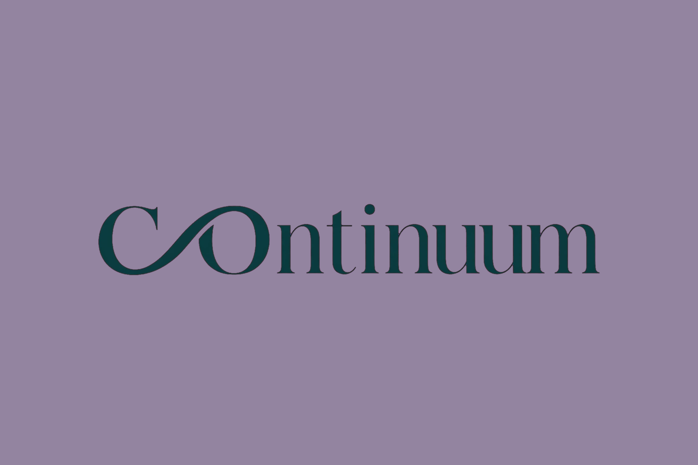
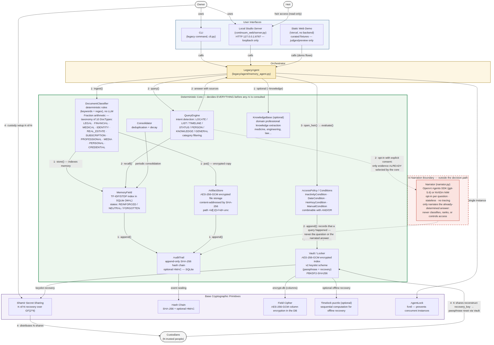

<p align="center">
  
</p>

<h1 align="center">Continuum</h1>

<p align="center"><strong>Proof for what matters.</strong></p>

*A private, cryptographically verifiable memory — for the people you love,
and for your own life while you're still living it.*

Licensed under the [Apache License 2.0](LICENSE).

## What Continuum is

Continuum turns a scattered life archive — documents, context, memories, and
the small details people need in a crisis — into a **private, source-backed
guide**. It is local-first: the deterministic core encrypts, classifies,
retrieves, and audits the record before any optional AI narration is involved.

> **Think of it as a crypto wallet for the documents that matter.** AES-GCM
> seals the vault, a SHA-256 audit chain makes meaningful changes verifiable,
> and Shamir shares let trusted people recover access together. The
> deterministic core decides evidence and access; optional AI may explain
> selected sources, but it never gets to decide anything.

It has two intentionally different experiences:

- **Real Studio:** a local encrypted vault for a person and the people they
  trust. It can be used entirely without an API key or cloud account.
- **Public evaluator:** a Vercel-hosted copy of the Studio with 40 redacted,
  deterministic fixtures, so judges can test the flow without receiving a
  vault or private documents.

**Try the public evaluator:** [continuum-olga-demo.vercel.app](https://continuum-olga-demo.vercel.app/)

## Where this comes from

Continuum is built and maintained by Olga Vasilieva. It started as a fork of
digital-legacy, an Apache-2.0 project by my daughter, Anna Tchijova: a
deterministic, encrypted, audited memory system built for one specific
moment — the day someone dies and the people who loved them inherit a hard
drive with no map. (The link goes here once that repository is public.)

That architecture — a core that decides and seals *before* any model is ever
consulted — turned out to be useful for a much longer list of moments than
just the last one. Continuum keeps every one of the original guarantees and
widens who it serves:

- **Someone hospitalized or suddenly incapacitated**, where a family member
  needs the same answers an heir would need — today, not after a funeral.
- **Someone disorganized**, for whom "where did I put that" is a daily tax,
  not a one-time crisis.
- **Someone with ADHD** — my own daughter among them — who loses track of
  documents, passwords, and appointments constantly, and loses real time
  re-finding things that were never actually lost, just scattered.
- **Someone who already lost a family member** and is now the one holding
  the hard drive with no map, trying to make sense of what's left.
- **A student with hundreds of scattered notes** — lecture notes, half-written
  papers, source citations — who needs to ask "where did I write about X"
  and get a sourced answer instead of grepping through folders by hand.
- **Anyone who just wants their own life organized** with the rigor a will
  deserves, without needing a crisis to justify the effort.

## The problem, stated plainly

When life becomes difficult to navigate — because someone is overwhelmed,
disorganized, living with ADHD or dementia, suddenly hospitalized, or grieving
a loss — people need the same thing: a trustworthy map of what matters. Wills,
insurance policies, medical history, the password to the account that pays
the mortgage, the one photo that explains a family story no document ever
recorded, and the notes that make everyday life manageable can sit scattered
across files, folders, and devices with no map and no order. Nobody should
have to become a forensic investigator of their own life just to find their
way through it.

The easy answer — "just point an AI at all the files and let people ask
questions" — trades one problem for a worse one. A model that can quietly
misread a document, invent a detail, or decide on its own who gets access to
what is not trustworthy with a will, a diagnosis, a house deed, or the
ordinary information someone needs to stay independent. A crisis is not the
moment to introduce a system that might be confidently wrong.

Continuum's answer is to separate the two jobs. A deterministic, encrypted,
audited core decides what exists, what it means, and who may see it. An AI —
used only with explicit, per-request consent — may put that already-decided
answer into gentle, human language. It is never asked to decide anything.
The people left behind deserve clarity delivered with warmth, but the clarity
itself has to be provable, not just plausible.

## Works without an API key

Continuum's core product requires no API key, cloud account, or model access.
The owner can create and lock a vault, capture and encrypt memories, classify
and retrieve evidence, verify the audit chain, configure access conditions,
and use the owner and heir flows entirely offline. An OpenAI API key is needed
only for the optional, per-request GPT-5.6 narration layer; disabling it never
changes a source, ranking, access decision, or integrity result.

## What Continuum actually does

- **Understands a lifetime of documents.** Ingests text and classifies it by
  domain (legal, medical, financial, property, professional, personal,
  credentials, and more) with a deterministic rule-based classifier — no
  model guesses at what a document *is*.
- **Answers questions with sources, not vibes.** `legacy query "where is the
  house contract?"` returns a ranked, cited answer from the owner's own
  material. Every answer can show exactly which document produced it.
- **Remembers the way people do.** A TF-IDF + STDP-inspired memory field
  reinforces what gets recalled often and lets what doesn't fade toward
  `FORGOTTEN` — never deleted, always auditable, never silently erased.
- **Speaks only when invited to.** With `OPENAI_API_KEY` set and explicit,
  per-question opt-in, GPT-5.6 may narrate the core's already-selected
  evidence in plain language. It cannot unlock a vault, choose what counts as
  evidence, rank a result, or grant access to anyone.
- **Hands the household down safely.** Owners define heirs and the exact
  condition that releases access to them — an inactivity period, a fixed
  date, a pre-shared key, or a manual switch — evaluated locally, by the
  core, never by a model.
- **Survives the worst-case scenario.** If the owner cannot ever be reached
  again, Shamir Secret Sharing lets `K` of `N` trusted people reconstruct
  access together, while any `K-1` of them learn nothing. Nobody holds the
  whole key alone.

## Open the real Studio — copy and paste

Requirements: Git and Python 3.11 or newer.

```bash
git clone https://github.com/olgavasilievaveg-hash/continuum.git
cd continuum
python3 -m venv .venv
.venv/bin/python -m pip install -e '.[agents]'
./run_studio.sh --workspace .continuum-demo --port 8787
```

The terminal prints the local Studio address when it starts. Click **Run a
safe sample** to explore a fictional local vault immediately: no personal
folder, API key, or account is required. For the ready-to-explore public
fixture with evaluator questions, use the **[Vercel demo](https://continuum-olga-demo.vercel.app/)** above.

### Demo mode — no files to import

After opening the Studio, click **Run a safe sample**. Continuum creates an
isolated `safe-demo` vault with four fictional records: an apartment deed,
emergency care plan, family archive, and subscription checklist. Then ask:

```text
Where is the apartment deed?
```

To demonstrate the read-only heir route, lock the safe demo and open it as an
heir with any heir ID and this deliberately public demo passphrase:

```text
continuum-demo
```

The safe demo is reset on every run and never replaces a real workspace. The
public evaluator above is the larger, preloaded 40-record fixture demo.

### Optional AI narration

The Studio works completely without an API key. For the optional OpenAI
narration layer — the hackathon integration — set your key before starting the
Studio:

```bash
export CONTINUUM_LLM_PROVIDER=openai
export OPENAI_API_KEY='your-key-here'
./run_studio.sh --workspace .continuum-demo --port 8787
```

OpenAI receives only the excerpts the deterministic core already selected,
and only after the person ticks the consent control in **Ask Continuum**.

NVIDIA is an optional OpenAI-compatible alternative for a local demo or a
different account:

```bash
export CONTINUUM_LLM_PROVIDER=nvidia
export NVIDIA_API_KEY='your-key-here'
./run_studio.sh --workspace .continuum-demo --port 8787
```

## The ethical line: AI narrates, it never decides

This is not a slogan; it is an architectural boundary enforced in code and
tested directly:

- The deterministic core selects, ranks, classifies, and grants access
  *before* any model is ever called. A model receives only the
  already-decided answer and the excerpts the core chose — never raw,
  unfiltered access to the vault.
- Narration is opt-in per question, stateless, untraced (SDK tracing and
  response storage are both disabled), and explicitly instructed to narrate
  only what it was given — never to invent, reorder, omit, or add a fact,
  and never to claim an access decision it did not make.
- Swapping the narrator off changes only the *wording* of an answer, never
  its *sources* or *whether it was allowed*. If a change to the narrator
  could ever change a decision, that would be treated as a defect in the
  architecture, not an acceptable trade-off.
- The audit trail records that narration happened and how many sources were
  involved — never the sensitive question itself, and never the narrated
  text. Privacy holds even in the system's own logbook.

## Public evaluator for judges

The [`web-demo/`](web-demo) directory is a deployable static copy of the
Studio interface. It starts with 40 curated, redacted fixtures and lets a
judge exercise creation, 3-of-5 recovery, owner/heir boundaries, integrity,
and deterministic question scenarios without cloning or running a vault.

Live demo: **[continuum-olga-demo.vercel.app](https://continuum-olga-demo.vercel.app/)**

To deploy it yourself, select `web-demo` as the Vercel Root Directory, or run:

```bash
cd web-demo
npx vercel --prod
```

It makes no API or model calls and never includes a real vault, corpus,
credential, recovery share, or API key. The local Studio above remains the
real encrypted product path.

Studio has separate owner and heir entry points. Heir access delegates to the
existing policy-aware core path and is intentionally read-only in the UI.
When creating a Studio workspace, the owner must explicitly choose an heir
release condition: an inactivity period or the deliberately marked no-policy
option. The UI never silently assigns a release policy.
Owners can capture a note or import a local `.txt`, `.md`, `.csv`, or `.json`
file after reviewing its text in the browser. Binary and PDF ingestion remains
in the existing CLI path.

New Studio workspaces enable the core's `memory.db` encryption before the first
capture and archive each captured text in the encrypted artifact store. Existing
vaults retain their current configuration; use `legacy encrypt-db` to migrate
an older vault deliberately.

## Design principles

- **Deterministic.** Classification, scoring (`Fraction` arithmetic, with no
  floats in decisions), and the Heir Guide produce the same output for the
  same input. An LLM may narrate results, but never decide them.
- **Auditable.** Every operation is sealed in an append-only hash chain
  (SHA-256 plus optional HMAC). `verify_legacy.py` is stdlib-only and can be
  given to heirs or auditors to verify the chain without installing anything.
- **Encrypted.** The legacy index lives in an AES-256-GCM vault
  (PBKDF2-SHA256, 260k iterations). Raw files can optionally be archived in
  the content-addressed encrypted `ArtifactStore`.

## Architecture

The current package is still named `legacy`; the package rename is a later
implementation step.

```
legacy/
├── core/       canonicalization, hash chain, audit trail, custody, time-lock,
│               database encryption, and process locking
├── ingestion/  document taxonomy and deterministic classifier
├── memory/     TF-IDF + STDP memory field and consolidation
├── knowledge/  encrypted professional-knowledge extractor
├── vault/      AES-GCM vault, encrypted artifact store, access conditions
└── agent/      owner/heir orchestration, queries, guide, doctor, export
```

## Diagrams and screenshots

### Architecture diagram



Source: [`visual/continuum_architecture_en.mermaid`](visual/continuum_architecture_en.mermaid).
An earlier iteration of the diagram is kept for reference in
[`visual/diagrama/`](visual/diagrama).

### Studio walkthrough

Screenshots of the local Studio UI, in the order they were captured:

<table>
<tr>
<td></td>
<td></td>
<td></td>
</tr>
<tr>
<td></td>
<td></td>
<td></td>
</tr>
<tr>
<td></td>
<td></td>
<td></td>
</tr>
<tr>
<td></td>
<td></td>
<td></td>
</tr>
</table>

### Rendered diagram preview


## Repository structure

The repository contains the product surface, the deterministic core, the
security primitives, the local Studio, and an extensive regression suite. The
tree below omits generated bytecode, local workspaces, and packaging metadata.

```text
continuum/
├── continuum_web/                 local-first Studio and browser presentation
│   ├── server.py                  loopback server and session coordinator
│   ├── narrator.py                bounded optional GPT-5.6 narration boundary
│   └── static/                    owner, heir, Spanish, and judges' interfaces
├── legacy/                        deterministic product core
│   ├── agent/                     queries, memory agent, heir guide, export, doctor
│   ├── core/                      audit chain, canonicalization, DB crypto,
│   │                               locking, Shamir custody, and time-locks
│   ├── ingestion/                 document taxonomy and rule-based classifier
│   ├── knowledge/                 encrypted professional-knowledge extraction
│   ├── memory/                    TF-IDF/STDP memory field and consolidation
│   └── vault/                     AES-GCM vault, artifact store, and access policy
├── cli/                           command-line entry point
├── tests/                         unit, integration, property, and security tests
│   ├── test_security_r*.py        documented red-team regression coverage
│   ├── test_vault*.py             vault and encryption coverage
│   ├── test_memory*.py            retrieval, memory, and DB encryption coverage
│   └── test_*.py                  audit, custody, export, policy, and Studio tests
├── vercel-judges-preview/         static judge-facing preview
├── HACKATHON.md                   submission architecture and live demo flow
├── KNOWN_LIMITATIONS.md           explicit design limits and trust boundaries
├── STRESS_TEST.md                 owner-data testing protocol and safety boundary
├── stress-oracle.template.md      private evaluation template
├── RETRIEVAL_FIX_2026-07-19.md    retrieval correction and rationale
├── verify_legacy.py                stdlib-only audit verification tool
├── pyproject.toml                 package metadata and optional dependencies
├── LICENSE                        Apache License 2.0
└── README.md                      product, architecture, security, and recovery guide
```

This is a working Python package with a CLI, a local web application, encrypted
storage, a separately testable core, judge-facing presentation surfaces, and
security regression tests. The browser UI is only the presentation layer; the
authoritative behavior remains in the `legacy/` core.

## Advanced CLI quickstart

```bash
pip install -e ".[dev,memory]"   # installs the `legacy` command

# Create a vault with a 90-day inactivity condition
legacy init --inactivity-days 90

# Ingest documents (classify, index, and audit)
legacy ingest ~/Documents --knowledge

# Store an encrypted copy of a critical file
legacy archive ~/Documents/will.pdf

# Query in natural language
legacy query "where is the house contract?"

# Generate the Heir Guide
legacy guide --output guide.md

# Add and revoke heirs
legacy heir-add maria_daughter --name "Maria" --with-key
legacy heir-revoke maria_daughter

# Export and verify a portable heir bundle
legacy export ~/legacy_for_maria
legacy bundle-verify ~/legacy_for_maria

# Rotate the passphrase, encrypt databases, and run health checks
legacy rekey
legacy encrypt-db
legacy doctor
legacy verify
```

## Custody and recovery

The central product scenario is that the passphrase dies with the owner.
Shamir Secret Sharing distributes a recovery key among `N` custodians so that
**any `K` can reconstruct it while `K-1` learn nothing**. This is a mathematical
guarantee over GF(2⁸), not a promise made by application logic.

```bash
# Five custodians; three are required
legacy custody setup --shares 5 --threshold 3

# Check configuration without a passphrase
legacy custody status

# Recover using hidden interactive share prompts
legacy custody recover --set-passphrase --actor olga
```

Passphrase rotation (`rekey`) does not invalidate shares: vault v2 uses
independent keyslots. Re-running `custody setup` does revoke the previous
custodian set.

An optional offline time-lock puzzle provides a third recovery path:

```bash
legacy custody calibrate --days 30
legacy custody timelock-setup --squarings 260000000000
legacy custody timelock-recover --set-passphrase --actor olga
```

The time-lock imposes a sequential computational work floor, not a wall-clock
date. See `KNOWN_LIMITATIONS.md` before relying on it.

## Security model

| Guarantee | Mechanism |
|---|---|
| Legacy index confidentiality | AES-256-GCM vault v2 with independent keyslots |
| Archived-file confidentiality and integrity | GCM plus SHA-256 content addressing |
| Database confidentiality at rest | Application-level AES-GCM field encryption, opt-in via `encrypt-db` |
| Recovery after passphrase loss | K-of-N Shamir custody |
| Safe passphrase rotation | Keyslot rewrapping without re-encrypting the payload |
| Tamper-evident operations | SHA-256 hash chain; HMAC resists chain recomputation |
| No silent CLI instance collision | Cooperative `AgentLock` |

The system does not promise semantic contradiction detection, entity
resolution, atomicity across separate SQLite databases, or a cryptographic
wall-clock time-lock. These limitations are documented with IDs and rationale
in [`KNOWN_LIMITATIONS.md`](KNOWN_LIMITATIONS.md). Read it before trusting
real data.

## Earned the hard way: seven rounds of internal red-team

Trust in a system that guards wills and medical records cannot rest on a
README's word. Before Continuum carried its current name, its predecessor
went through seven documented internal red-team rounds — each one abducting
a plausible failure mode, deducing a concrete, checkable consequence, and
confirming it by induction against the live code before calling it fixed.
Every round below shipped a fix and a regression test; nothing was patched by
softening a test until it passed.

| Round | Scope | Representative findings |
|---|---|---|
| R1 | Internal baseline sweep, 8 findings | TOCTOU hash divergence on in-memory content; symlink traversal in directory ingestion; a non-constant-time passphrase comparison in the CLI |
| R2 | Memory & audit semantics, 10 findings | Non-atomic vault sealing (a crash mid-`seal()` could strand the legacy); reinforce/forget with no auth or audit trail; silent semantic contradictions never surfaced to anyone |
| R3 | Cryptographic consistency, 6 findings | `memory.db` living outside the chain of trust; unbounded score growth overflowing to `float('inf')`; a store-plus-audit atomicity gap |
| R4 | Vault sealing | `seal()` failing open: a *wrong* passphrase could silently replace the vault and destroy custody |
| R5 | Ciphertext structure | In-band signaling — the ciphertext's own prefix was valid, exploitable plaintext |
| R6 | Search index | A legacy FTS5 search index surviving encryption with the plaintext still readable inside it |
| R7 | Access policy & suppression | A second heir's key silently locking out every heir; an attacker able to flip a memory to `FORGOTTEN` outside the audit trail, invisible to both the heir and the integrity check |

The R7 fixes are the two most recent, and both now ship with dedicated
regression tests in `tests/test_security_r7.py`:

- **Multi-heir lockout.** Access conditions default to requiring *every*
  listed condition. Under the naive reading, registering a second heir's key
  made the vault unopenable by *any* heir — the worst possible moment to
  discover a lockout is after the owner is gone. Heir keys now form their own
  OR-group: any registered heir's own key satisfies that part of the policy,
  while the group still participates in whatever AND/OR the owner configured
  for the other conditions.
- **Invisible suppression.** A memory's `state` governs whether an heir can
  ever see it again, but that field is unauthenticated metadata. Someone with
  raw filesystem access to `memory.db` could flip a memory to `FORGOTTEN`
  without the heir noticing and without the integrity check catching it. The
  check now cross-references every `FORGOTTEN` memory against the audit
  trail; a suppression with no matching `MEMORY_FORGOTTEN` event is flagged
  as tampering, not silently trusted.

This is why the security posture in this README is a claim about a system
that has been attacked on paper, repeatedly, by its own builders — not a
claim about a system nobody has yet tried to break.

## Tests

```bash
python -m pytest -q
```

## Environment variables

| Variable | Effect |
|---|---|
| `LEGACY_DATA_DIR` | Data directory (default `~/.legacy`) |
| `LEGACY_OWNER_ID` | Owner identifier |
| `LEGACY_HMAC_KEY` | Hex HMAC key for the audit trail (recommended: at least 32 bytes) |
| `LEGACY_HMAC_KEY_FILE` | Alternative path to a file containing the key bytes |

## Hackathon materials

- [OpenAI Build Week brief, product flow, and OpenAI/Codex integration](HACKATHON.md)
- [Judge submission and compliance record](SUBMISSION_COMPLIANCE.md)

## Continuum

*Song: [Continuum](https://suno.com/song/049456fe-7d61-4820-8ccd-fb0377b7e925), by Olga Vasilieva*

**Verse 1**<br>
A photograph inside her hands,<br>
A face she knew, now lost in sands.<br>
A name that fades, a silent room,<br>
A memory disappearing too soon.<br>
A thousand files, a thousand days,<br>
Lost in forgotten digital haze.<br>
A life of moments, dreams and tears,<br>
Waiting through the passing years.

**Pre-Chorus**<br>
And if the voices start to fade,<br>
If every path becomes a maze,<br>
There must be something we can do,<br>
To keep the stories shining through.

**Chorus**<br>
We are more than data, more than time,<br>
More than a file or a broken line.<br>
Every heartbeat, every trace,<br>
Every memory has a place.<br>
When the road becomes unclear,<br>
When the answers disappear,<br>
We will build a bridge to see...<br>
A human legacy.

**Verse 2**<br>
A restless mind that cannot slow,<br>
A thousand thoughts that come and go.<br>
Searching for words, searching for light,<br>
Trying to find what feels right.<br>
A silent hand inside a room,<br>
A voice waiting through the gloom.<br>
A daughter asking where to start,<br>
Looking for pieces of a father’s heart.

**Bridge**<br>
Not a copy, not a machine,<br>
Not a shadow of what has been.<br>
But a protected, trusted guide,<br>
Keeping precious worlds inside.<br>
Encrypted memories, safely stored,<br>
Every chapter, every word.<br>
Audited, protected, clear and true,<br>
A path for those who follow you.

**Final Chorus**<br>
We are more than data, more than time,<br>
More than a file or a broken line.<br>
Every story, every name,<br>
Deserves to live beyond the frame.<br>
When the memories fade away,<br>
When tomorrow hides today,<br>
Continuum will help us find...<br>
The human soul we leave behind.

**Outro**<br>
A life can change.<br>
A memory can fade.<br>
But every story<br>
can remain.
